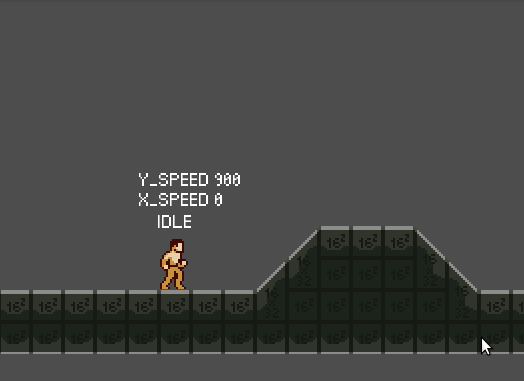

I was at the barber shop last week, waiting on a chair while my wife was getting her hair cut. After few minutes of drawing practice, I was getting pretty bored. So, I decide to browse godot's Reddit and read all the new threads. A specific discussion got my attention, a thread where everybody can share their weekly progress on their project.

That how I got this developer diary idea. It already been two months since I begun to create my own side scroller engine and why not writing down my progress on it ?

Event if it's only a prototype engine for the moment and not a game of it own, it could be a good motivation to just keep my progress history over time.


## Why Godot ? What is this ?

[Godot](https://godotengine.org/) is a free and open source game engine. I discover it while searching for alternatives to unity. Why ? Because I never felt Unity was made for 2D game (event if they are a lot of great 2D Games) and everything was just to workaround and camera trick to make thing work. I wanted a dedicated engine to 2D develop. 

At first, I through about using gamemaker studio or Construct 3 but the price, in both case was a huge turn off.

And I discover Godot, the free and open source alternative. The open source philosophy was was a big plus although I was kinda afraid of using gdscript.

But after using it for two hours, I was convinced, Godot would be the best choice for my amateur video game developer hobby. Thanks to [Nathan from gdquest](https://www.youtube.com/channel/UCxboW7x0jZqFdvMdCFKTMsQ) that gave me a huge motivation boost after seeing is tutorial. 

Because resources and tutorials never felt officials when I was on unity and finding goods and reliables resources where a huge advantages for switching to Godot. 


## My first step with gdscript

C# support was still in a unstable state, that's why I quickly switch to gdscript. I dit it by buying [MAKE PROFESSIONAL 2D GAMES WITH GODOT](https://www.gdquest.com/product/godot/make-pro-2d-games/) from gdquest. The first chapter was enough to understand how gdscript works and beside the `elif` statement, everything was pretty easy. 

I quickly decide to make my own side scroller while following gdquest's course. It's seems to be good choice to use all the new stuffs I was learning by trying to use them in a complete different type of 2D game (Nathan use a Zelda like game has example).


## Choosing an art style

I'm ain't good at making art for my game. I try to get better by following drawing lesson but I still need to practice...a lots. That why I brought [cyangmou's Side-Scroller Template](https://cyangmou.itch.io/side-scroller-character-template) to help me. It more rewarding to got some real character moving instead of just basic geometric form. 

### 

## Final state machine

*Since I created those dev log a little bit late, I will only tell about the major problem I encounter the last three month. But for the next entry blog, they will explain more recent struggle and would be easier to follow* 


After struggling for 3 weeks at managing slope with `move_and_slide` function, someone on gdquest discord tell me to see final state machine chapter. He suggest me this since all my code was managed in the same file and was pretty confusing between my current basic state (idle, move, jump).  



Event if switching to a fsm would take me time and would not fix my initial struggle, it would be useful to get a better and readable code. And oh my, it's so wonderful to work with this.


I never really like animator controller of Unity, alway felt strange for 2D game. But coding my own state machine with the help gdquest course was such a life change. Managing directly through code instead of just bunch of boolean for unity's mecanim.

It also help me to export all my physics 2D behavior to an extern node. 


```python
extends Node2D

# physics
export (float) var GRAVITY = 900
const FLOOR_NORMAL = Vector2(0, -1)
const SLOPE_SLIDE_STOP = 5.0
const MAX_SLOPE_DEGREE = deg2rad(46)
onready var min_air_raycast = get_parent().get_node('MinAirRaycasting')
onready var left_raycast = get_parent().get_node('RayCastLeft')
onready var right_raycast = get_parent().get_node('RayCastRight')


func compute_gravity(host, delta):
	if host.gravity_enable:
		host.velocity.y += GRAVITY * delta
		if host.velocity.y > GRAVITY:
			host.velocity.y = GRAVITY

	host.velocity = host.move_and_slide(host.velocity, FLOOR_NORMAL, SLOPE_SLIDE_STOP, 5, MAX_SLOPE_DEGREE)
	host.is_grounded = host.is_on_floor()
	host.is_on_wall = host.is_on_wall()

	# slope descent
	if not host.is_grounded:
		if min_air_raycast.is_colliding():
			host.is_grounded = true

	# on wall only if left/right raycast collide too
	if host.is_on_wall:
		host.is_on_wall = (right_raycast.is_colliding() or left_raycast.is_colliding())
```

That's called at every frame through my character script.


```python
# Delegate the call to the state
func _physics_process(delta):
	var new_state = current_state.update(self, delta)
	Physics2D.compute_gravity(self, delta)
```

And my bug ?

It was two bad coding error. First of all, I never set a maximum gravity force, so my character could get a -9000 force apply to him. My second ? I set the max slope angle to 45 while my slope where at 45 degree. I set to 46 and boom, everything was working. BUT I still need to use some raycast to set a minimal air time.


## Three month later, where I am now ?

Slope where pretty much my most frustrating bug so here my current state.


I got a fully functional final state machine. My character can

- Be idle

- Walk

- Run

- Jump

- Wall jump and wall slide

- Punch

- Use a sword

- BackDash

- Dodge Roll

- Use a ladder with intro/outro transition on both side of the ladder

- Get hit

- Died

  

## End of dev log

Yeap, this a strange dev lop 0, but I needed to resume three month of development without writing a complete book about it.


## Coming soon 

My next feature are gonna be

- Character should be able to throw spear
- Character should be able to use a bow
- Character should be able to use magic power by throwing sort

So yes, I'm gonna create a object pooling feature why kinematic projectiles (spear, arrow) and non-kinematic projectile (magic).