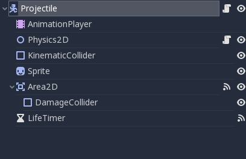
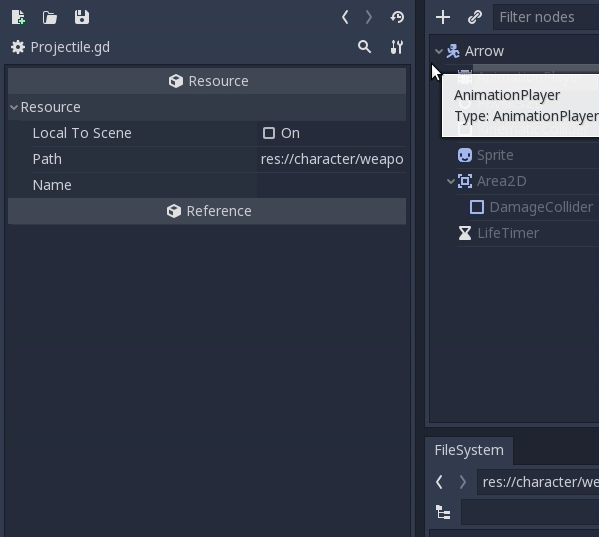
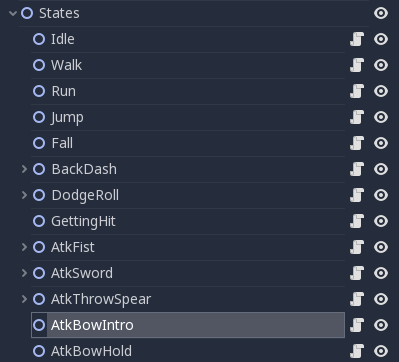
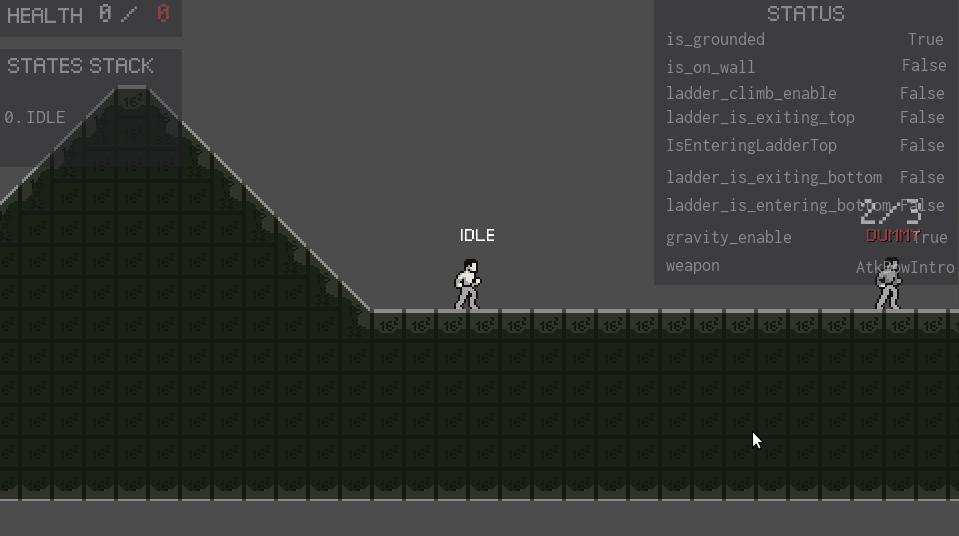
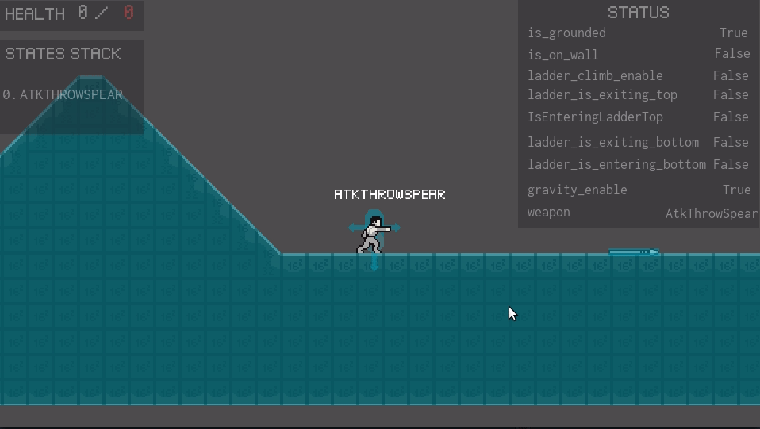

After a long first entry, here my second one. This week, I try to create an projectile factory for the throwing spear, bow and launch sort animation. 


## Projectiles Factory

### Object Pooling

As an ex unity develop, I through about creating an object pooling. BUT in me research, I found the following [tweet](https://twitter.com/reduzio/status/1073284242086551552) of [Juan Linietsky](https://twitter.com/reduzio). 

> A lot of new Godot users ask about object pooling...
> You don't need to do that in Godot because allocating/freeing scenes/classes is fast and there is no garbage collector in GDScript/Godot.
> I wonder how we could best un-educate new Godot users about this practice..

Knowing that, I came with much simpler solution


### Projectile Scene

First of all, I create my main projectile scene where all my projectile will inherit from.



It's composed of 

- KinematicBody: Since a spear and an arrow are physic object that follow the hard law of gravity, a kinematic body was use.

- Animation Player: I wanted a small animation when the object need to disappear, so a cheap animation player with a Fly and Death state was enough.

- A node that compute his physic: Similar to the one that I use in my Character scene, I created a second physic script that use move_and_collide instead of move_and_slide

  ```
  extends Node2D
  
  # physics
  export (float) var GRAVITY = 900
  
  
  func compute_gravity(host, delta):
  	host.velocity.y += GRAVITY * delta
  	if host.velocity.y > GRAVITY:
  		host.velocity.y = GRAVITY
  
  	host.move_and_collide(host.velocity * delta)
  
  ```

- Area2d: I wanted my projectile to disappear after X seconds when it hit the ground, that why I use an area2d to get when it hit something.

- Sprite

- Timer: Second case scenario, what happen if my projectile never hit something ? This timer is use to kill hit after X seconds.


And my script looks like this

```java
extends KinematicBody2D

const Damage = preload('res://character/weapons/Damage.gd')

export(Vector2) var FORCE = Vector2(400, 100)
export(int) var amount = 1
export(Vector2) var KNOCKBACK_FORCE = Vector2(75, 200)

onready var Physics2D = $Physics2D
onready var AnimationPlayer = $AnimationPlayer
onready var LifeTimer = $LifeTimer
onready var Sprite = $Sprite
onready var Area2D = $Area2D

var velocity = Vector2()


# compute force and sprite orientation
func initialize(direction):
	velocity = Vector2(FORCE.x * direction, FORCE.y)
	$Sprite.scale.x = direction


func _ready():
	AnimationPlayer.play('Fly')


func _physics_process(delta):
	Physics2D.compute_gravity(self, delta)


func _on_Area2D_body_entered(body):
	if body.is_in_group('Walls'):
		AnimationPlayer.play('Death')
	else:
		Damage.knockback(body, KNOCKBACK_FORCE, amount, get_global_position())
		Area2D.monitoring = false


func _on_LifeTimer_timeout():
	queue_free()
```


### Child Scene

I created Spear and Arrow that both inherit from Projectile. I wasted sometime remembering how to manage inherited AnimationPlayer since by default, they always be synced with the parent. After make some research, I found the hidden button `Make Sub-Resources Unique` that make my inherited AnimationPlayer unique.





## Character's state

Since I use a final state machine, creating and adding a new behavior is alway the same thing.

### First step - Node and Character.gd

I create a new state node (a node2D), a new animation in AnimationPlayer and add the new path to my main character script



```java
onready var states_map = {
	...
	'AtkThrowSpear': $States/AtkThrowSpear,
	'AtkBowIntro': $States/AtkBowIntro,
	'AtkBowHold': $States/AtkBowHold,
	'AtkBowShoot': $States/AtkBowShoot,
	...
}

...
    
var cooldown_states = {
	'BackDash': false,
	'DodgeRoll': false,
	'AtkFist': false,
	'AtkSword': false,
	'AtkThrowSpear': false,
	'AtkBowIntro': false
}
```


### Step 2 - States

I create a state script eg. `atk-throw-spear.gd` and set all common parameters like cooldown, animation, what it does at enter and exit etc.

```java
extends 'res://character/states/state.gd'

const ProjectilesFactory = preload('res://character/weapons/ProjectilesFactory.gd')
const SPEAR_SCENE = preload('res://character/weapons/distance/Spear.tscn')

export (float) var COOLDOWN_TIMER = 1

onready var stream = load('res://character/states/combat/sfx_wpn_punch1.wav')
onready var AtkThrowSpearCooldownTimer = $AtkThrowSpearCooldownTimer

var direction = 1
var spawn_position = null

func enter(host):
	host.get_node('AnimationPlayer').play('AtkThrowSpear')
	play_sound(host, stream)
	host.velocity.x = 0
	direction = host.look_direction.x
	spawn_position = $AtkThrowSpearSpawnPositionRight if direction == 1 else $AtkThrowSpearSpawnPositionLeft

func exit(host):
	AtkThrowSpearCooldownTimer.wait_time = COOLDOWN_TIMER
	AtkThrowSpearCooldownTimer.start()
	host.cooldown_states['AtkThrowSpear'] = true

func _on_animation_finished(anim_name):
	assert anim_name == 'AtkThrowSpear'
	emit_signal('finished', 'Idle')

func shoot():
	ProjectilesFactory.instantiate(SPEAR_SCENE, spawn_position.get_global_position(), direction, get_tree().get_root())
```

And that's all


## Features Added

Character can now shoot arrow with a bow




Character can now throw spear