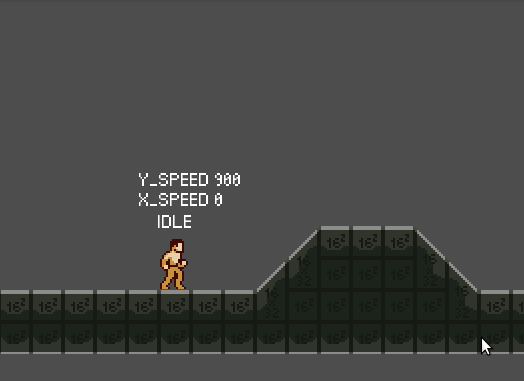

I was at the barber shop last week, waiting on a chair while my wife was getting her hair cut. After few minutes of drawing practice, I decide to browse godot's Reddit and read all the new threads. A specific discussion got my attention, a thread where everybody can share their weekly progress on their project.

That how I got this developer diary idea. Event since It's already been two months since I begun to create my own side scroller engine, I thought it could be a great way to keep a trace of my progress and learning by writing them down on my website.  


## Godot I choose you (after some failed attempt)

[Godot](https://godotengine.org/) is a free and open source game engine. I discover it while searching for alternatives to unity. Why switching ? Because I never felt Unity was made for 2D game (event if they are a lot of great 2D Games) and everything was just workaround and camera trick to make thing work. I wanted a dedicated engine to 2D develop. 

At first, I through about using gamemaker studio or Construct 3. But the price, in both case, was a huge turn off.

And I discover Godot, the free and open source alternative. The open source philosophy was a big plus although I was not that happy with their own custom language: gdscript.

But after trying it for two hours, I was convinced; Godot would be the best choice for my amateur video game developer ambition. Thanks to [Nathan from gdquest](https://www.youtube.com/channel/UCxboW7x0jZqFdvMdCFKTMsQ) that gave me a huge motivation boost after beginning with his tutorial. 

And yeah, resources and tutorials never felt officials when I was on unity and finding some goods and reliables resources where a huge advantages for switching to Godot. It can be really frustrating to never find what you want or get the feeling that what you have found is not the good way.


## My first step with gdscript

C# support was still in an unstable state in Godot 3.0.6, that's why I felt that the best choice was to switch to gdscript. To make thing easier, I dit it with the help of [MAKE PROFESSIONAL 2D GAMES WITH GODOT](https://www.gdquest.com/product/godot/make-pro-2d-games/) from gdquest. Like I said earlier, good resource are an advantage. With only the first chapter, I learn enough to understand how gdscript works and beside the `elif` statement, everything was pretty easy. 

Since my learning curve was going faster than expected, I quickly decided to challenge myself by making my own side scroller engine because why not.


## Choosing an art style

I'm ain't good at making art. I try to get better by following drawing lesson but I still need to practice...a lots. That why I brought [cyangmou's Side-Scroller Template](https://cyangmou.itch.io/side-scroller-character-template) to help me. It's more rewarding to get some real character moving instead of just basic geometric form. 


## Final state machine

*Since I created those dev log a little bit late, I will only tell about the major problem I encounter the last three month. But my next entry blog will explain more recent struggles and should be easier to follow* 


After struggling for 3 weeks at managing slope with `move_and_slide` function, someone on gdquest discord tell me to watch the final state machine chapter. He suggest me this since all my code was managed in the same file and was pretty confusing between my current basic state (idle, move, jump).  



Event if creating a final state machine (or fsm if you are cool) would be time consuming and would not fix my initial struggle, I through it would be useful to get better and readable code. And oh my, it's so wonderful to work with this.

I never really like Unity's mecanim (their animation controller), it alway feel strange for 2D game. But coding my own state machine with the help gdquest course was such a life changing experience. Managing directly through code instead of just a bunch of boolean for unity's mecanim, seems more clear and logical for me.

It also help me to export all my physics 2D behavior to an extern node. 

```python
extends Node2D

# physics
export (float) var GRAVITY = 900
const FLOOR_NORMAL = Vector2(0, -1)
const SLOPE_SLIDE_STOP = 5.0
const MAX_SLOPE_DEGREE = deg2rad(46)
onready var min_air_raycast = get_parent().get_node('MinAirRaycasting')
onready var left_raycast = get_parent().get_node('RayCastLeft')
onready var right_raycast = get_parent().get_node('RayCastRight')


func compute_gravity(host, delta):
	if host.gravity_enable:
		host.velocity.y += GRAVITY * delta
		if host.velocity.y > GRAVITY:
			host.velocity.y = GRAVITY

	host.velocity = host.move_and_slide(host.velocity, FLOOR_NORMAL, SLOPE_SLIDE_STOP, 5, MAX_SLOPE_DEGREE)
	host.is_grounded = host.is_on_floor()
	host.is_on_wall = host.is_on_wall()

	# slope descent
	if not host.is_grounded:
		if min_air_raycast.is_colliding():
			host.is_grounded = true

	# on wall only if left/right raycast collide too
	if host.is_on_wall:
		host.is_on_wall = (right_raycast.is_colliding() or left_raycast.is_colliding())
```

It's called at every frame through my character script.

```python
# Delegate the call to the state
func _physics_process(delta):
	var new_state = current_state.update(self, delta)
	Physics2D.compute_gravity(self, delta)
```

And my bug ?

It was two bad coding mistake. First of all, I never set a maximum gravity force, so my character could get a -9000 force apply to him. 


The second one ? I set the max slope angle to 45 while my slope where at 45 degree. When I set it to 46, boom, everything was working. 


## Three month later, where I am now ?

Slope where pretty much my most frustrating bug so here my current state.


I got a fully functional final state machine. My character can

- Be idle

- Walk

- Run

- Jump

- Wall jump and wall slide

- Punch

- Use a sword

- BackDash

- Dodge Roll

- Use a ladder with intro/outro transition on both side of the ladder

- Get hit

- Died

  

## End of dev log

Yeap, this a strange dev lop 0, but I needed to resume three month of development without writing a complete book about it.


## Coming next

My next feature are gonna be

- Character should be able to throw spear
- Character should be able to use a bow
- Character should be able to use magic power 

So yes, I'm gonna create a object pooling feature with kinematic projectiles (spear, arrow) and non-kinematic projectile (magic).

