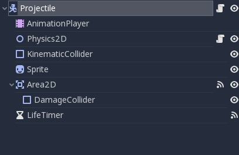
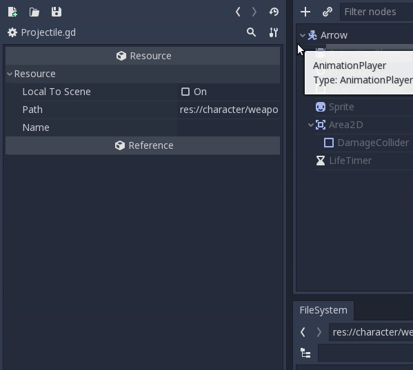
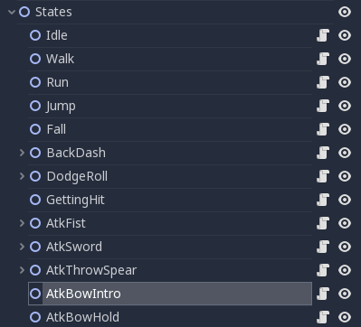
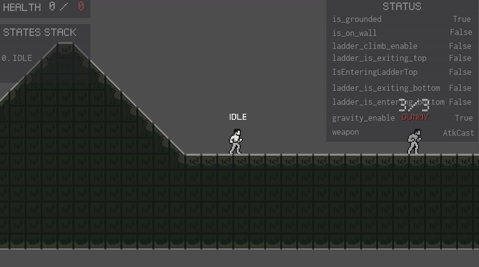

After a long first entry, here my second one. Don't worry, it should be lighter. If I take a look back at last week devlog, my goal was to create an object pool to manage all my future type of projectile (throwing spear, bow and magic). This wasn't achieved since I simply don't need object pooling in Godot. 


## Projectiles

### To object pooling or not to object pooling

As an ex unity developer, I through object pooling would be necessary and it would be the most efficient solution. BUT in my research, I found the following [tweet](https://twitter.com/reduzio/status/1073284242086551552) of [Juan Linietsky](https://twitter.com/reduzio). 

> A lot of new Godot users ask about object pooling...
> You don't need to do that in Godot because allocating/freeing scenes/classes is fast and there is no garbage collector in GDScript/Godot.
> I wonder how we could best un-educate new Godot users about this practice..

So I was wrong and I'm happy about it because I can now come with a much simpler solution.


### Projectile Scene

First step, I need a **main** projectile scene. It will serve has a template for all my projectiles.  

*For all unity developers up there, Godot use a scene inheritance system. To explain real quick, let's say that they are the equivalent of prefabs. Since a scene can inherit from an another scene and will all sync together. An inherited scene can also be customized to differ from the parent scene.*



Here a what my main scene looks like and It's composed of 

- A KinematicBody: Since a spear and an arrow are physic object that follows the hard law of gravity, a kinematic body was used. 

- An Animation Player: I wanted a small animation when the object needs to disappear, so a cheap animation player with a *Fly* and *Death* state was enough.

- A node2D that host the physic2D script: similar to the one that I use in my Character scene, I created a second physic script that uses move_and_collide instead of move_and_slide since my projectile don't need to... slide.

  

  ```c
  extends Node2D
  
  # physics
  export (float) var GRAVITY = 900
  
  
  func compute_gravity(host, delta):
  	host.velocity.y += GRAVITY * delta
  	if host.velocity.y > GRAVITY:
  		host.velocity.y = GRAVITY
  
  	host.move_and_collide(host.velocity * delta)
  
  ```

  

- An Area2d:  Use to get when my projectile hits something. When it happens, it will trigger the *Death* animation state (make the projectile disappear after X seconds).

- A Timer: Use to prevent the case scenario where my projectile never hit anything. This timer is used to kill hit after X seconds.

- A Projectile.gd script attached to my KinematicBody2D

 

```c
extends KinematicBody2D

const Damage = preload('res://character/weapons/Damage.gd')

export(Vector2) var FORCE = Vector2(400, 100)
export(int) var amount = 1
export(Vector2) var KNOCKBACK_FORCE = Vector2(75, 200)

onready var Physics2D = $Physics2D
onready var AnimationPlayer = $AnimationPlayer
onready var LifeTimer = $LifeTimer
onready var Sprite = $Sprite
onready var Area2D = $Area2D

var velocity = Vector2()


# compute force and sprite orientation
func initialize(direction):
	velocity = Vector2(FORCE.x * direction, FORCE.y)
	$Sprite.scale.x = direction


func _ready():
	AnimationPlayer.play('Fly')


func _physics_process(delta):
	Physics2D.compute_gravity(self, delta)


func _on_Area2D_body_entered(body):
	if body.is_in_group('Walls'):
		AnimationPlayer.play('Death')
	else:
		Damage.knockback(body, KNOCKBACK_FORCE, amount, get_global_position())
		Area2D.monitoring = false


func _on_LifeTimer_timeout():
	queue_free()
```


### Child  Scene

My main scene created, time to make children. I created a Spear and Arrow scene, both inherit from Projectile. I wasted some times remembering how to manage inherited AnimationPlayer. Yeah, because by default, AnimationPlayer will always stay synced with the parent. That's why need to make it unique. Strangly finding how to dot it was pretty long but I finally found the hidden button `Make Sub-Resources Unique` that make my inherited AnimationPlayer unique.




## Make my characters throw those projectiles

Since I use a final state machine, creating and adding a new behavior to my character is always the same thing.

### First step - Setting up the future new state in Character.gd

* In my `Character.tscn`, I got node named `States` that contain all my state (seems pretty logical at this point). That's where I add a new state (node2D) linked with the future state script (e.g. `atk-throw-spear.gd`).

  

* My new state created, I add my new animation in my AnimationPlayer (e.g. `AtkThrowSpear` to keep the same name) 

* The final step, for this part, is to link those new paths in my main character script. 

* Optional step, since this new state is an attack, I know it will need to cool down to prevent super Saiyan combo attack. To manage my cool down, I set it through a dictionary. Why not a boolean ? I think with my future inventory system, access current equipped weapon through a dictionary should be the most efficient solution.

```c
onready var states_map = {
	...
	'AtkThrowSpear': $States/AtkThrowSpear,
	'AtkBowIntro': $States/AtkBowIntro,
	'AtkBowHold': $States/AtkBowHold,
	'AtkBowShoot': $States/AtkBowShoot,
	...
}

...
    
var cooldown_states = {
	'BackDash': false,
	'DodgeRoll': false,
	'AtkFist': false,
	'AtkSword': false,
	'AtkThrowSpear': false,
	'AtkBowIntro': false
}
```


### Step 2 - Coding the state

Time to code my new state script (eg. `atk-throw-spear.gd`).  Every state inherits from state script, it's some kind of abstract class.


### state.gd

```c
# Base class all states inherit from
extends Node

signal finished(next_state_name)


func _ready():
	set_process(false)
	set_physics_process(false)
	set_process_input(false)


# Initialize the state. E.g. change the animation
func enter(host):
	pass


# Clean up the state. Reinitialize values like a timer
func exit(host):
	pass


func handle_input(host, event):
	pass


func update(host, delta):
	pass


func _on_animation_finished(anim_name):
	pass


func play_sound(host, stream):
	host.get_node('AudioStreamPlayer').stream = stream
	host.get_node('AudioStreamPlayer').play()
```


### atk-throw-spear.gd

```c
extends 'res://character/states/state.gd'

const ProjectilesFactory = preload('res://character/weapons/ProjectilesFactory.gd')
const SPEAR_SCENE = preload('res://character/weapons/distance/Spear.tscn')

export (float) var COOLDOWN_TIMER = 1

onready var stream = load('res://character/states/combat/sfx_wpn_punch1.wav')
onready var AtkThrowSpearCooldownTimer = $AtkThrowSpearCooldownTimer

var direction = 1
var spawn_position = null

func enter(host):
	host.get_node('AnimationPlayer').play('AtkThrowSpear')
	play_sound(host, stream)
	host.velocity.x = 0
	direction = host.look_direction.x
	spawn_position = $AtkThrowSpearSpawnPositionRight if direction == 1 else $AtkThrowSpearSpawnPositionLeft

func exit(host):
	AtkThrowSpearCooldownTimer.wait_time = COOLDOWN_TIMER
	AtkThrowSpearCooldownTimer.start()
	host.cooldown_states['AtkThrowSpear'] = true

func _on_animation_finished(anim_name):
	assert anim_name == 'AtkThrowSpear'
	emit_signal('finished', 'Idle')

func shoot():
	ProjectilesFactory.instantiate(SPEAR_SCENE, spawn_position.get_global_position(), direction, get_tree().get_root())
```

And that's all


## Hey, what happen to non-kinematic projectile that you were talking about last week ?

Oh, that's right, I talked about creating a kinematic projectile and a non kinematic one. It simply didn't need to create the non-kinematic one. I just needed to set the gravity to 0 in the physic2D script of my kinematic projectile. Same thing at the end, and I avoid useless code was avoid.


## Features Added

The character can now shoot arrows with a bow


The character can now throw spear


The character can now cast magic (magic has not been created yet, but admire this magnificent spear)




## End of dev log

An another week that was pretty productive. Godot's scene approach seems so much faster and easier to understand to me than prefabs. The work flow itself is simpler to implement. I know that prefabs from Unity were really great but scene are just easier to understand and to use.


## Coming next 

- Improving asset management in folder structure
- Add some new attack movements (whip, spear, longsword, great axe)
- Think about how to manage ledge climbing