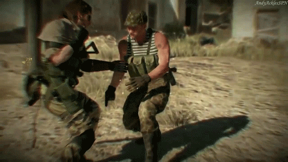
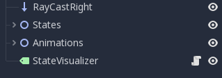
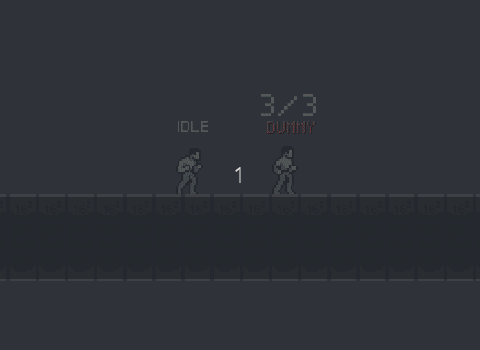
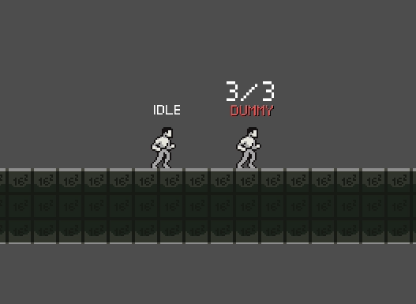
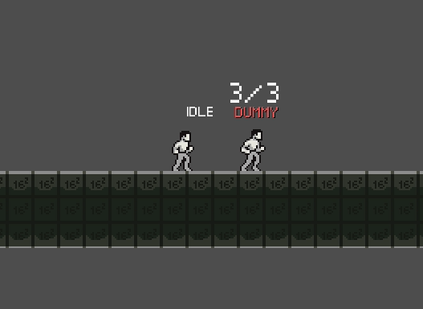
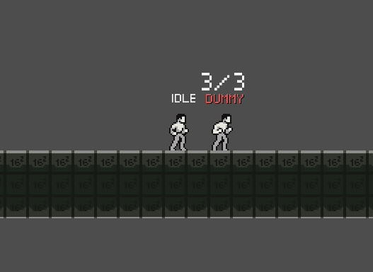
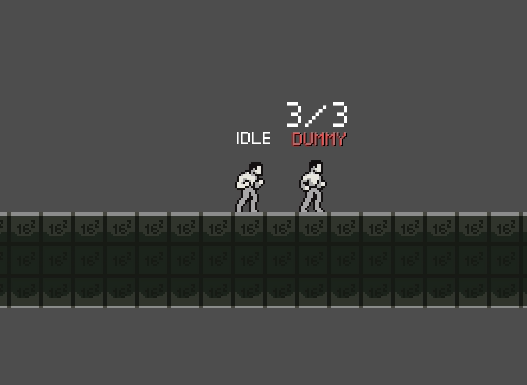
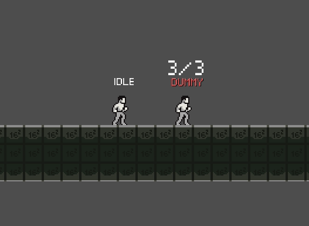

Ah already a new devlog ! But still on the same old subject; the character move set. But this time, I focused a bit more on his melee attack. Time to CQC and manage hitboxes.




Also, a new milestone for the project (already ?!), not only for me but for the whole Godot community, the wonderful version 3.1 has finally been released. Since I'm still at an early stage of development, I already take the risk to migrate the project. Alright, let begin.

## New attack, same workflow

Adding an attack is pretty fast and convenient with my current system.

But before showing off, I still need to explain a little bit more about how this is managed by my final state machine. First of all, it's working with the help of two nodes. 



- The first one, `States` regroup all the state script e.g. `idle.gd`, `walk.gd` etc. 
- The second one,  `Animations` regroups all animations sprite sheets. 

Godot's AnimationPlayer needs to be linked to a sprite node to load a sprite sheet. So if you work with multiple sprite sheets, you need:

*  Multiples sprite
* Multiples sprite means multiple sprite nodes 
* Multiple sprite nodes mean hiding all the other node when one is active
* Hiding all the other node mean adding a lot of property into the AnimationPlayer

And with AnimationPlayer's native system, this can take forever. Imagine if you got one 100 sprite sheet and for each animation, you need to create 99 visible props set to false ! This is just impossible by hand. That's why I came with an easier and faster solution, I manage the show/hide feature in my code. 

```c
# show / hide spritesheet based on current state
func _change_animation(state: String) -> void:
	for animation in Animations.get_children():
		if animation.name != state:
			animation.hide()
		else:
			current_animation = animation

	current_animation.show()


func _on_AnimationPlayer_animation_started(anim_name: String) -> void:
	_change_animation(anim_name)
```

> Where _on_AnimationPlayer_animation_started is a signal emitted by AnimationPlayer

Now, let's go back to my melee attack work flow. 

First step, I add a `WeaponDamageZone` to my attack animation node. `WeaponDamageZone` is scene that  manages an Area2D. This Area2D detect when it hit something. When it does, it knocks it back in the air and also damaging it. I set it directly has a child of the associated animation since it's much easier to set the `WeaponDamageZone` size this way because

- `WeaponDamageZone`'s monitoring value is managed by the AnimationPlayer
- Only my Animations node is scaled from  -1 to 1 when the character changes direction

This step done, I create a new  animation in my Animation Player and add the frame. Just like I wrote three lines earlier, AnimationPlayer  will also manage when the `WeaponDamageZone` need to be enabled and disabled.

And it's almost already done. Last step has already been explained in my last [devlog](http://localhost:8000/developer-diary-devlog-1-projectiles), so let not repeat ourself.

And voilà 

### Showcase

#### Fist



#### Sword



#### Great sword




#### Axe




#### Great Axe




#### Whip attack



## Migrate to 3.1 or static vs dynamic language

Alright, let's talk about the new Godot version. It adds a lot of new features like you can see right [here](https://godotengine.org/article/godot-3-1-released). One of the new cool feature is the possibility to add typing to our variables. This is what we call static coding since the engine will not able to change a boolean to a string. I read a great [article](https://www.gdquest.com/tutorial/game-design/godot/gdscript/typed-gdscript/) on [gdquest.com](https://www.gdquest.com) about it.  You should read it too.

I think this feature can be great since you never know the day you are going to change your variable's type without knowing it and you will break **everything**. And it makes gdscript looking less like javascript and more like typescript... Or javascript with flow or C# (event if it's inspired by python), whatever you understand me.

And that's why I take my time to migrate every script from a dynamic writing to a static one... but not without some unanswered questions at the end.

For example, my handleInput will return the parent function call. How should I cast my function return value ? A function ? Since it calling my parent function ? Or maybe nothing since when it detects an input, it will emit a signal... but since I use the return keywords it can't return void without getting a warning. So without real answer, I just said my function return an InputEvent and thing seems to work.

```c
func handle_input(host: Character, event: InputEvent) -> InputEvent:
	if event.is_action_pressed('move_up') or event.is_action_pressed('move_down'):
		host.get_node('AnimationPlayer').playback_speed = 1
		is_animation_stopped = false

	return .handle_input(host, event)
```


But besides this type of question, everything was pretty much easy to migrate.


## End of dev log

I'm really happy about the new Godot version. With his new `move_and_slide_with_snap`, I will be able to improve my character movement when he's on a slope.

## Coming next 

- Dive through one way platform
- Ledge grabbing
- Improve ladder scene