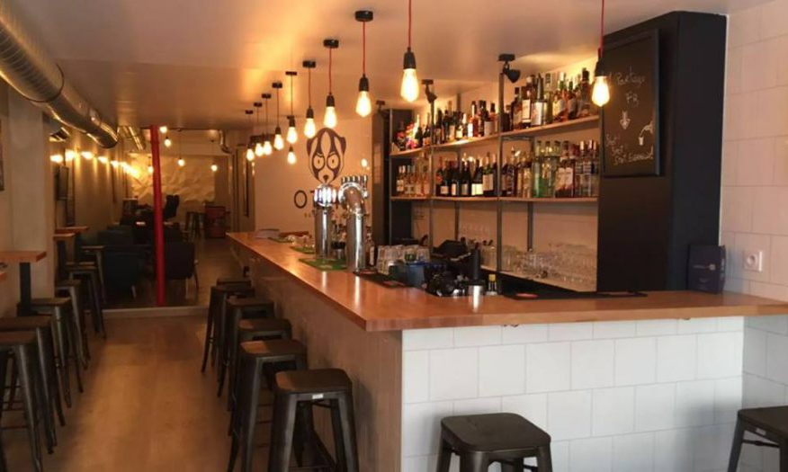
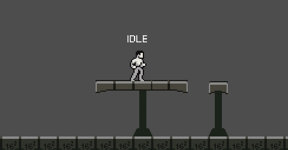
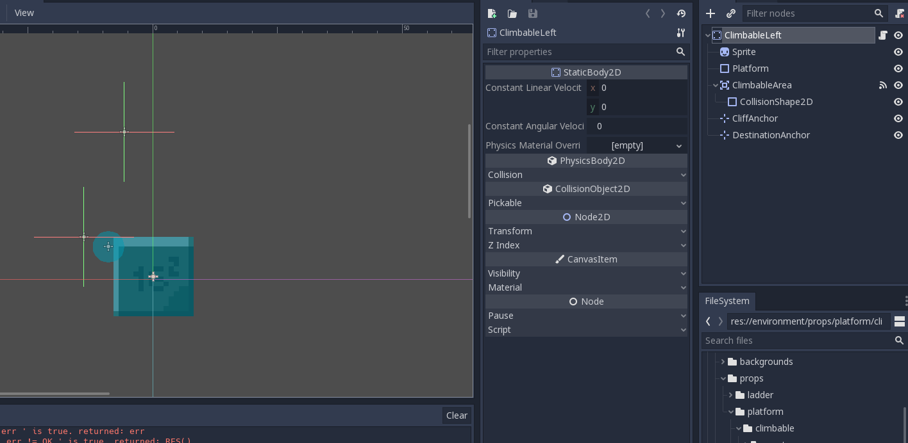
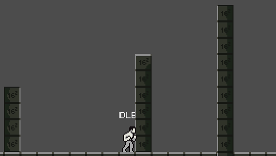
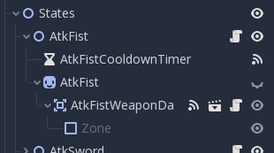

Hi folks ! If you read this, you already know the drill, it's time for a new devlog. This week, I got the opportunity to go to my first meet-up and meet the amazing [Nathan from GDquest](https://www.gdquest.com/). I also added some new animations to the game like diving through a platform and ledge grabbing. Finally, I did some refactoring on my animation manager.

## Monthly Paris Indie Game Dev Meetup

Ah! My first video game developer meet-up. It's been pretty great, meet a lot of people that are in or interested by the video game development. I also got the chance to chat with [Nathan from GDquest](https://www.gdquest.com/) and learn about how he decide to teach Godot and also talk about my user experience with Godot (great so far).



Nothing much to say about the meet-up, I will surely attempt the next one.

## Let's dive and climb

### Diving through platform

The greatest advantage with Godot, it's certainly about his out of the box tools. If I want a one way platform, I simply need to check `one way collision` and we're done. Don't need to work for two one hours to add your own one way collider, it's already there ! In 1 minutes, my character can jump through the platform and land on it. Pretty easy ! But, there is always a but, if I want my character to pass though this platform by pressing `down + jump`, I need to write a little bit of code.

Thankfully, things are still pretty easy. First of all, if I want to play my diving animation, my character will need to be in the `crouch state`. When he is on it, I can make it switch to the divekick animation with the combination key `down + jump` and let him pass through the platform.





On code, it's look like this.

```c
extends InAir


func enter(host: Character) -> void:
    host.get_node('AnimationPlayer').play('Divekick')
    host.set_collision_mask_bit(5, false) # one way platform


func _on_animation_finished(anim_name: String) -> void:
    assert anim_name == 'Divekick'
    emit_signal('finished', 'Fall')
```

I think you can guest it by reading the code, I put my one-way-platform on a specific layer and mask (I named it one way platform, so original). I simply remove the collision mask when my character is on the `divekick` state. At the same time, the one way platform checks if the character has exited his area to reset the collision mask to true.

```c
extends StaticBody2D


func _on_Area2D_body_entered(body: PhysicsBody2D) -> void:
	if body.is_in_group('Character'):
		body.is_on_one_way_platform = true


func _on_Area2D_body_exited(body: PhysicsBody2D) -> void:
	if body.is_in_group('Character'):
		body.is_on_one_way_platform = false


func _on_ActiveMask_body_exited(body: PhysicsBody2D) -> void:
	if body.is_in_group('Character'):
		if not body.get_collision_mask_bit(5):
			body.set_collision_mask_bit(5, true) # one way platform
```

The collision re-setted to true, my character can now re-jump on the platform and land on it.

### Ledge Grabbing

Second new animations, ledge grabbing. Nothing really complex, I simply created a specific scene where my character can enter in collision with a climbable corner.



When entering the area, the following code will keep a trace of the

- Cliff anchor, where the character need to stay on the ledge hang state.

- Destination anchor, where he is going to land.

  

And the Climbable area, will set some inner state variables to active the ledge climbing mode.

```c
extends StaticBody2D


func _on_ClimbableArea_body_entered(body: Object) -> void:
	if body.is_in_group('Character'):
		body.ledge_climbing_enable = true
		body.ledge_hanging_position = $CliffAnchor.get_global_position()
		body.ledge_finish_position = $DestinationAnchor.get_global_position()


func _on_ClimbableArea_body_exited(body: Object) -> void:
	if body.is_in_group('Character'):
		body.ledge_climbing_enable = false

```

With all these conditions meet, the character will transit to the `ledge hang` state.

```c
extends InAir


func enter(host: Character) -> void:
	host.get_node('AnimationPlayer').play('LedgeHang')
	host.gravity_enable = false
	host.velocity = Vector2(0, 0)
	host.position = host.ledge_hanging_position


func handle_input(host: Character, event: InputEvent) -> InputEvent:
	if event.is_action_pressed('move_down'):
		host.gravity_enable = true
		host.ledge_climbing_enable = false
		emit_signal('finished', 'Fall') 
	elif event.is_action_pressed('move_up'):
		emit_signal('finished', 'LedgeClimb')

	return .handle_input(host, event)
```

In this state, the gravity is disabled to let the character handing and... the rest the code is pretty explicit. If I press the move up key, my character will transit to the `ledge climb` state.

```c
extends InAir


func enter(host: Character) -> void:
	host.get_node('AnimationPlayer').play('LedgeClimb')
	host.velocity = Vector2(0, 0)


func exit(host: Character) -> void:
	host.gravity_enable = true
	host.ledge_climbing_enable = false
	host.position = host.ledge_finish_position


func _on_animation_finished(anim_name: String) -> void:
	assert anim_name == 'LedgeClimb'
	emit_signal('finished', 'Idle')
```

Finally, the animation plays, the character set his new position to the destination anchor global position and that's it !



## Refactoring

This is gonna be quick. Like Like I have already explained in my [previous entry](https://llangis.xyz/developer-diary-devlog-2-attacks-and-godot-3.1), I work with multiple sprite sheets. I set them in the node called Animations. I simply moved every sprite inside the state node. It's more logical this way since I don't need to search the corresponding sprite sheets every time I made some change on a state.



 

## End of dev log

Thing are going great but I'm still not happy with some animations. I will try to improve them.

## Coming next 

- Some particles
- Interfaces
- Controller support