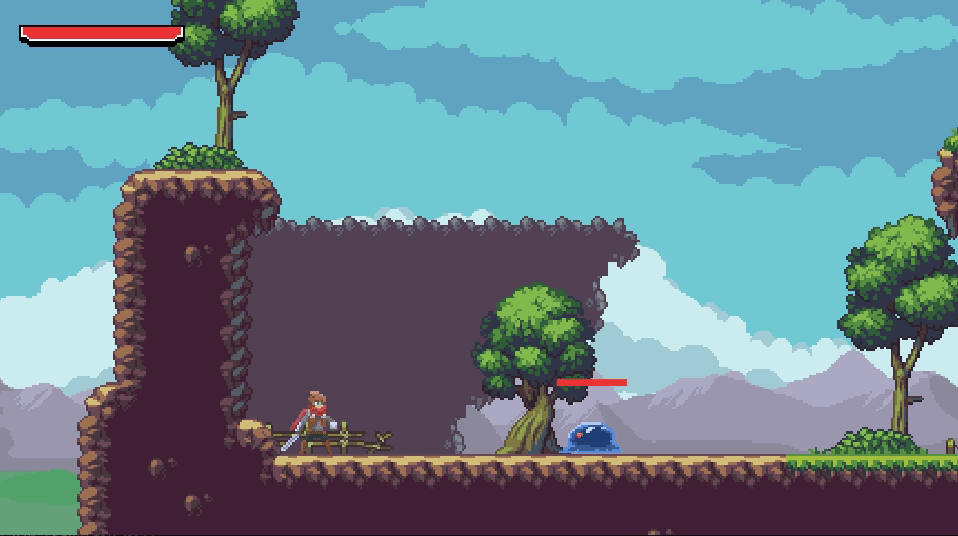
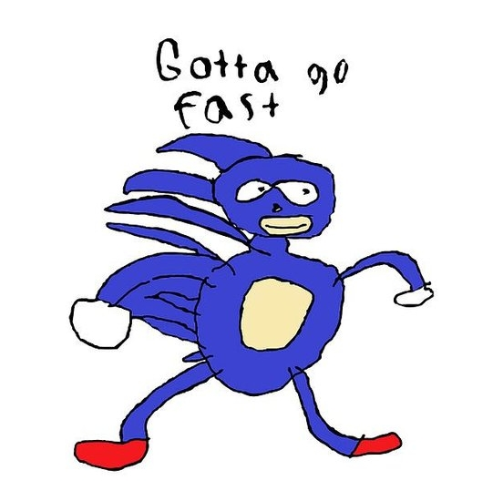

As a software development engineer in front end technologies (or I know how to use ReactJs), I'm surrounded by lots of other developers. Some of them are interested in developing their own video games but just don't know where to start. That's why, I got a lot of questions about where to start, what engine to use, where do you get those sweets assets, etc. I love those questions because I love creating video games. I wouldn't define myself has a complete video game developer, but I think that I'm beginning to be pretty okay. 

Since it's already been 5 months since I first started working with Godot Engine, I'm now able to be quite efficient with my development. I'm surely not the best, I pretty sure that there is a lot of stuff that I'm unaware of, but I think I'm good enough to share my current knowledge and even more, I think that my knowledge can be useful for the people that want to learn video game development. 

So, fully confident about myself, I talked with my coworker and asked them if they want me to teach them how to make a platformer. They said yes, and right after, I begin to code the demo.

Of course, things always get bigger when the subject is great, so I begin with a simple platformer, to a more sophisticated action-adventure platformer. And since I did more work than expected, why not share it with the Internet? That why I decided to create a series of tutorials that will explain how to re-create my demo. It also a good exercise to plan my future presentation to my coworker, so I think this is a win-win situation.

# Which subject are gonna be covered ?

Even if the project is still in **WIP**, the project should contain all the following features:

- A basic retro physic engine
- A pretty complete character moveset
  - Jump
  - Double jump
  - Wall jump
  - Ledge grab
  - Getting hit
  - Diyng
  - Grounded combo attack
  - Air combo attack
- IA controlled enemy
  - Slime
    - A vicious little creature that will follow you if you get to close to him.
    - Will try to bite you if you too close
    - Multiples behavior (idle, move, attack, getting hit, dying)
  - Eagle
    -  A flying enemy that mind his own business, if you don't get in his path (move along multiples waypoints)
- GUI
  - Player health bar
  - Enemy health bar
- Tilemaps system
- Pause Menu 
- Loading screen 
- Main menu
- Dialogue system 
- Basic cinematic system
- Some cool sounds and music

## How your gonna explain how to do things ?

Since all my code is hosted on my [Github](https://github.com/Levrault/godot-2d-action-adventure-platformer-demo), I will not explain line by line how to do things. You will even discover that I will re-explain some subjects that I already talked about in my devlog. So it's gonna be more suitable for people that want to go fast and prefer learning by example and reading code.

But I will do my best to cover and explain some parts and concept that I found relevant. It's just, I will not explain how to make the character jump line by line but more how to integrate a jump mechanic in a state machine.

Alright, now I just need to write my tutorials !