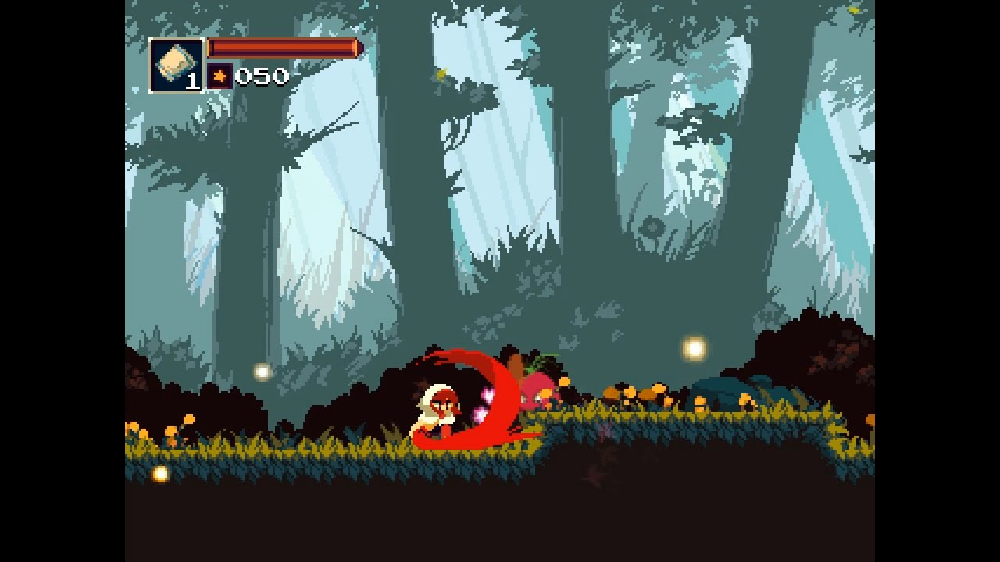

Alright folks, here my first tutorial ever. Since the demo is an action adventure platformer in **pixel art**, the project will need a specific configuration to make it work the way we want.

## Friendly reminder of what is pixel art ? 

Pixel art is when you use low res art to create your game. In the 80's and 90's, when computer and console were pretty limited, pixel art was the industry standard. Nowadays, this art style is still popular because 

- it looks great
- it restriction force imagination
- people love pixel art
- got this wonderful retro vibe

> *Owlboy, one of the best looking pixel art game*

Here a [great article](https://kano.me/blog/my-thoughts-on-very-low-resolution/) by a great pixel artist and pixel art teacher [Pedro Medeiros](https://twitter.com/saint11?lang=fr), it will help you understand why choosing pixel art in a modern video game is still a relevant choose today. I will also recommend Pedro's [patreon](https://www.patreon.com/saint11) for the awesome tutorial he posts there. As one of the masterminds behind the gorgeous Celeste, he knows his stuff and you could learn a lot by following him.

> Celeste
>

## How to set up Godot's project settings for a pixel-perfect game

### But before, a little explanation about aspect ratio

Pixel art is made to work in a very low resolution. But in our modern time, monitor now support really high resolution. So, how can you make a low resolution game looks good on a high resolution screen ? You simply need to respect the good aspect ratio. The ratio is the relationship between the width and the height screen and the current industry standard still seems to be the 16:9 aspect ratio.

So, basically, the game engine that renders your game works like this; on a higher resolution, it will *stretch* your low resolution game to fit the current resolution. If your native resolution respects the 16:9 aspect ratio, it will still look good on a high 16:9 aspect ratio resolution.

> Iconoclast, because it's beautiful

But what happens when you stretch a game that got a different aspect ratio ? E.G. If you have a game with a ratio of 4:3, the image will look a little bit "fat" if you make it fits on a 16:9 screen. But, if you really want to use a 4:3 aspect ratio, you can prevent the image distortion by forcing the game engine to put margin instead of stretching.

> Momodora: Reverie Under The Moonlight, a 4:3 aspect ratio game that put two black borders to keep the good aspect ratio on a 16:9 screen

Alright, now that we all know how ratio works, how it's gonna be applied with the action adventure platformer demo ? For the demo, I choose the 480x270 native resolution based on one of the tweet (couldn't find the original tweet) of [Thomas or Mr. Helmut](https://twitter.com/mrhelmut) (developer at [Flying Oak Games](https://twitter.com/FlyingOakGames)).

> What about #ScourgeBringer?
> It uses a 480x270 scene, which means it will look perfect at 1080p and 2160p.
>
> And it will have a switchable pixel perfect mode for the other resolutions. You will be able to have a fullscreen game, or having slight margins with perfect pixels.
>
> 320x180 is the perfect situation, it gets a round ratio on 720p, 1080p, 1440p, and 2160p.
>
> 320x180 and 640x360 are the safest.

### Configure Godot

So, now that the perfect native resolution has been chosen, it's time to open Godot. Open *Project Settings > Display > Window*. 

- Set 480 for the width, 270 for the height
- Activate the Resizable option
- Set a test width and height, I choose 960x540 (it's the native resolution multiplied by 2). But you can change by whatever resolution you want, it just needs to respect the 16:9 aspect ratio.
- Set Stretch > Mode to 2d
- Set Stretch > Aspect to keep

It's almost over, we just need to activate the *Use Pixel Snap* options. You will find it in *Rendering > Quality > 2D > Use Pixel Snap*.

A quick definition for pixel snap would certainly be *"it forbid half pixel rendering"*. Let just say that if your X axes sprite coordinate is 0.5, the engine will render only the half of a pixel and it will break your wonderful pixel sprite. It's also prevents some images distortion when a sprite is rotated.

## How to import pixel art ?

Even if the project configuration is done, there still a last little thing to know. By default, Godot doesn't import low-resolution sprite how we want. It will apply a filter that will blurry the sprite since the default import settings are made for high resolution sprite. 

Let test that, download the sprite of our hero, just right here [Animated Pixel Adventurer](https://rvros.itch.io/animated-pixel-hero) (and feel free to thank his author) and create a new Godot project or simply download this [example](https://github.com/Levrault/godot-2d-action-adventure-platformer-demo/tree/master/learn-godot-1-setting-up-for-pixel-art).

Create a new scene, add a sprite node and set the hero sprite has texture. You can also change the **vframes** to 16 and the **hFrames** set to 7 to only show the hero and not the complete sprite sheet. Now that this is done, you can see that our sprite is blurry.

Let's fix that, 

- click on the sprite sheet and go to the Import that
- Click on preset > 2d, pixel art
- Re-import
- And voilà, we are done with the pixel art configuration

## Complementary lectures

To write this first tutorial, I made some complementary search to be sure that I don't give bad information. I think the more you know, the better you're gonna be, so here my lecture.

[Godot Engine and pixel art: A better love story than Twilight](https://medium.com/@tumeowilliam/godot-engine-and-pixel-art-a-better-love-story-than-twilight-4c8155ba71cd) by William Tumeo

[PIXEL PERFECTION IN GODOT](https://alvarber.gitlab.io/pixel-perfection-in-godot.html) by AlvarBer

[How to use Pixel Art Sprites in Godot (beginner tutorial)](https://www.youtube.com/watch?v=dZ2zN3h1Kp4) by the GDQuest youtube channel