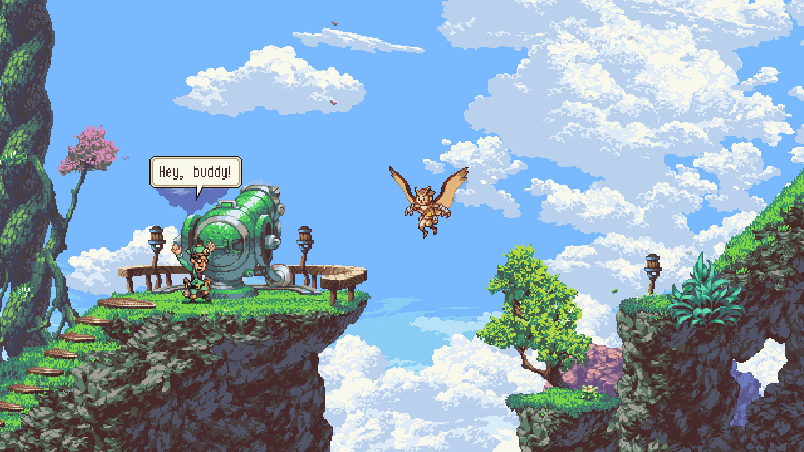
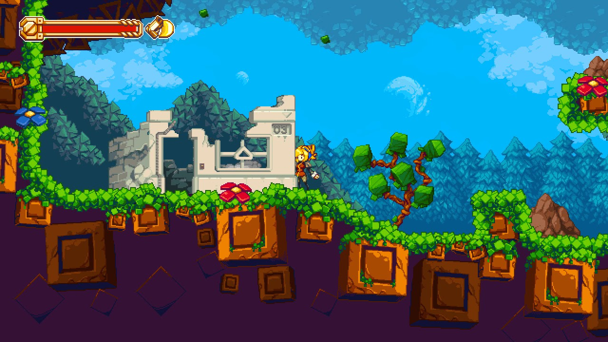
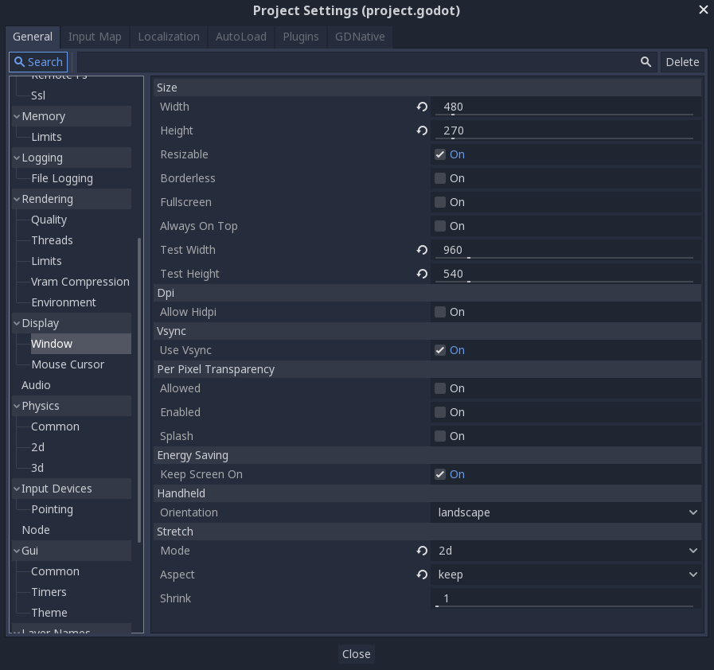
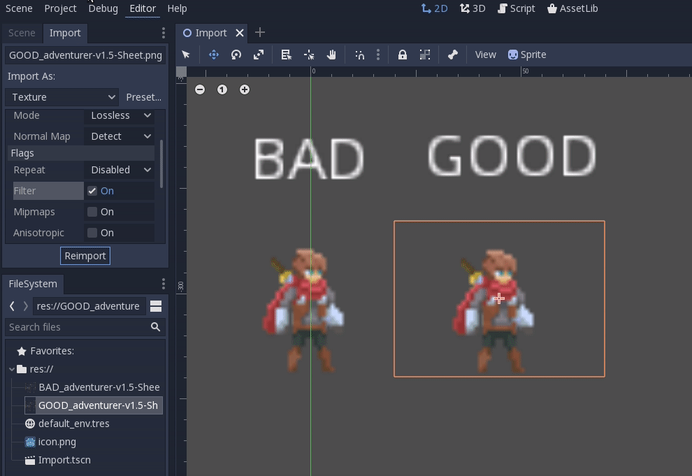

Since the demo is an action adventure platformer in pixel art, we will need to configure one or two things in Godot to get the best image.

## Friendly reminder of what is pixel art ? 

*A really quick explanation to be sure that everybody knows what pixel art is.*

Pixel art is when you use low res sprite to make your game, just like all the old video game from the 80's and 90's. It is still popular among  the indie game dev because 

- look great
- restriction force you to be inventive
- people love pixel art and I love pixel art

Here a [great article](https://kano.me/blog/my-thoughts-on-very-low-resolution/) by great pixel artist [Pedro Medeiros](https://twitter.com/saint11?lang=fr), it will help you understand why choosing to make low resolution art is still relevant today. You can also check his [patreon](https://www.patreon.com/saint11) since this guy is a reference if you want to learn how to make how to make your own art (he's one the mastermind behind the gorgeous Celeste).

## How to set up Godot's project settings for a pixel-perfect game

Pixel art is made to work in low resolution. Even if you play them with a modern monitor at 1080p, they will look great if they respect the good aspect ratio. The ratio is the relationship between the width and the height of the game resolution. The majority of modern monitor and TV are using the 16:9 aspect ratio. That's why you need to be careful with your native game resolution. Because if you create a game with a ratio of 4:3, it will be stretchy on a 16:9 monitor (or have some big black margin to keep the good ratio).

For my action adventure platformer, I wanted to keep a modern 16/9 aspect ratio. Based on one of the tweet of [Thomas or Mr. Helmut](https://twitter.com/mrhelmut) (sorry can't find the orignal link to the tweet), he explains witch resolution he chooses when he code pixel art game at [Flying Oak Games](https://twitter.com/FlyingOakGames).

> What about #ScourgeBringer?
> It uses a 480x270 scene, which means it will look perfect at 1080p and 2160p.
>
> And it will have a switchable pixel perfect mode for the other resolutions. You will be able to have a fullscreen game, or having slight margins with perfect pixels.
>
> 320x180 is the perfect situation, it gets a round ratio on 720p, 1080p, 1440p, and 2160p.
>
> 320x180 and 640x360 are the safest.

480x270 seems to be the best resolution for the demo, look great and scale great. 

So, open Godot > Project Settings > Display > Window. 

- Set 480 for the width, 270 for the height
- Active Resizable
- Set a test width and height, I choose 960x540 (it's 480x270 multiplied by 2). But you can change by whatever resolution you want, it just needs to respect the 16:9 aspect ratio.
- Set Stretch > Mode to 2d
- Set Stretch > Aspect to keep

It's almost over, we just need to activate the Use Pixel Snap options. You will find it in Rendering > Quality > 2D > Use Pixel Snap.

A quick def for pixel snap would be, it forbid half pixel rendering. Let just say that if your X sprite coordinate  is 0.5, the engine will render only the half of a pixel and it will break your wonderful pixel sprite.

### Complementary lectures about settings up pixel perfect in Godot

[Godot Engine and pixel art: A better love story than Twilight](https://medium.com/@tumeowilliam/godot-engine-and-pixel-art-a-better-love-story-than-twilight-4c8155ba71cd) by William Tumeo

[PIXEL PERFECTION IN GODOT](https://alvarber.gitlab.io/pixel-perfection-in-godot.html) by AlvarBer

## How to import pixel art ?

By default, Godot doesn't import low-resolution sprite how we want. By default, Godot applies a filter that will blurry the sprite. 

Let test that, download the sprite of our hero, just right here [Animated Pixel Adventurer](https://rvros.itch.io/animated-pixel-hero) (and feel free to thank his author) and create a new Godot project.

(if you don't want to, here the [example](https://github.com/Levrault/godot-2d-action-adventure-platformer-demo/tree/master/learn-godot-1-setting-up-for-pixel-art))

If you create a new scene with a sprite and add the hero (Animations > vframes set to 16 and hFrames set to 7 if you do not want the complete sprite), he will be blurry.

Let's fix that, 

- click on the sprite sheet and go to the Import that
- Click on preset > 2d, pixel art
- Re-import
- And voilà

