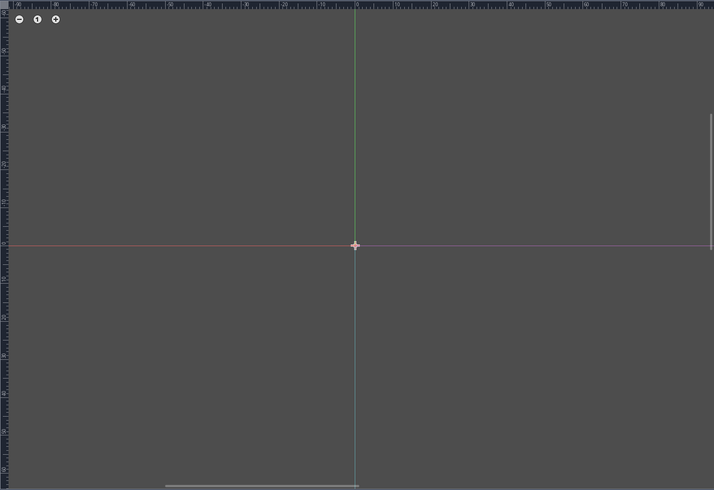

2D physic is certainly the most confusing concept I had to work with. Not because I ain't good at math (pretty average) but because I never knew how to apply it to the video game concept. 

But before all, just to be sure that everyone gets it, by 2D physic, I mean coding your retro engine for a 2D platformer. Just like in the old Mario game.


I found theses concepts difficult to implement for the following reasons

- like every newcomer, I barely understand the engine I was working with ([Unity](https://unity.com) at the time).
- I don't like maths and it doesn't like me.
- Lack of experience and clues to follow

My biggest question was "**Where should I start** ?". I saw a lot of code examples and tutorials, but I never felt to understand the good part. I just copy-paste without being confident about it and hoping it's gonna work as intended.

Now, after years of struggle, I think I finally get it and I'm gonna share my small knowledge with you, keep it simple as possible and hope it gonna help you.

Just to be more playful and add some context to this article, I created mister Dogwar, our fantastic main character for a 2D platformer (don't be rude, I'm still new to drawing). This brave soldier gonna be used in for our example.


## Godot's axis behaviour 

Let first take a look at the Godot's editor view. Since we work on a 2D platformer, everything is computed from a Cartesian plane. Here how it looks on Godot's 2D view:



- For the X-axis, the number goes, from left to right, negative to positive. 
- For the Y-axis, the number for, from top to bottom, negative to positive.

Alright, this can be a little bit confusing, here a more simple representation.


The Y axes are simply inverted if you're used to some other engine like Unity (where the Y axes go from positive to negative instead). The more you scroll down, the more the Y axis's value will increase and the more you scroll up, the more it will decrease.

## Gravity

Now that we understand Godot's 2D view, we can now begin the **maths** part. We gonna implement world's gravity. Don't worry, it's pretty simple. It will look like this.


We need to increase the Y-axis value to let our character Dogwar fall if he is not colliding with anything. Gravity is a value that we change over each frame. 

```c
# physics
export (float) var GRAVITY:= 900

func compute_gravity(host, delta: float) -> void:
	if host.gravity_enable:
		host.velocity.y += GRAVITY * delta
		if host.velocity.y > GRAVITY:
			host.velocity.y = GRAVITY
```

Let's explain this a little bit further. `compute_gravity` is called in the `_physics_process(delta: float):` method. `_physics_process` give us **delta**, it represented the time between each frame that our computer render. We multiply our gravity (here 900 px/sec) by it to ensure that our gravity will work the same on different hardware. Because if our game is rendered at 60 fps on a high PC and 30 fps on low-end hardware, we want to be sure that our falling speed stays coherent.

This code needs to be called every time since like gravity in the real world, it applies to us even when we do nothing.


## Moving with velocity

If you look closely at the code, you saw a variable called velocity. For those who are not aware of this concept, the velocity of an object is

> the rate of change of its position with respect to a frame of reference, and is a function of time. 
>
> Source [wikipedia](https://en.wikipedia.org/wiki/Velocity)

So our actual gravity is our current velocity where a force on the Y axes is always applied to simulate gravity. We simply need to change this velocity to let our character move or jump and whatever we need to do.

If we increase or decrease the X-axis value, the character will move left or right.


On code, it looks like this

```c
func move(host, input_direction: Vector2, speed: float, acceleration: float) -> void:
	host.velocity.x = lerp(host.velocity.x, host.look_direction.x * speed, acceleration) if input_direction else 0
```

I check witch input is used to check if I need to increase or decrease the X value (computed through look_direction where his value can be 1 or -1) and use the lerp function to make the movement smoother. That's pretty much all.

## Jumping with velocity

Alright, here the last thing to cover all the basic features. How to make the character jump. If I refer to the gravity equation, if at each frame we apply a force to make the character fall, if we want to make our character going up, we need to made the opposite of the gravity.

Just read the following jump script used in my state machine:

```c

export (float) var MAX_JUMP_FORCE:= 550.0
export (float) var MIN_JUMP_FORCE:= 350.0


func enter(host: Player) -> void:
	host.get_node('AnimationPlayer').play('Jump')
	host.snap_enable = false
	host.velocity.y = -MAX_JUMP_FORCE


func handle_input(host: Player, event: InputEvent) -> InputEvent:
	if event.is_action_released('jump'):
		if abs(host.velocity.y) > MIN_JUMP_FORCE: 
			host.velocity.y = -MIN_JUMP_FORCE
		
	return .handle_input(host, event)


#warning-ignore:unused_argument
func update(host: Player, delta: float) -> void:
	var input_direction: Vector2 = get_input_direction()
	update_look_direction(host, input_direction)
	
	if host.speed == 0 and input_direction:
		host.speed = SPEED
		host.acceleration = ACCELERATION
	
	move(host, input_direction, host.speed, host.acceleration)
	if host.velocity.y > 0:
		emit_signal('finished', 'JumpMidAir')
```

This script has 4 functions

- Play the jump animation
- Apply a jump force for a single frame (enter function)
- Manage a max/min jump force based on the time we pressed the jump input (handle input function)
- Let the player control the character when he jump (update function)

With my poor drawing skill, we can convert the code like this


By setting a negative force to our Y axes, we make Dogwar going up. But since our gravity is also applied, that force will decrease the force at every frame and after X frames, the Y velocity will be positive and will make our character going down. And if we want to make our character move while jumping, just like the move behaviour, we just need to change our X value.


## Conclusion

You can get more context by taking a look at those scripts for my 2D platformer demo created especially for theses articles

- [Physics 2D](https://github.com/Levrault/godot-2d-action-adventure-platformer-demo/blob/master/demo/engine/Physics2D.gd) 
- [Character motion state machine](https://github.com/Levrault/godot-2d-action-adventure-platformer-demo/tree/master/demo/characters/player/states/motion)


### More references

[Godot Engine 3 - Platform Game Tutorial by HeartBeast](https://www.youtube.com/watch?v=wETY5_9kFtA&t=1393s) 

[Godot 3 - Platformer Tutorial - Part 1 - Getting Started by UmaiPixel](https://www.youtube.com/watch?v=MMsMtPVUtUE&t=1s)

[Unity Creating a 2D Platformer (E01. set-up) by Sebastian Lague](https://www.youtube.com/watch?v=MbWK8bCAU2w&t=2s)