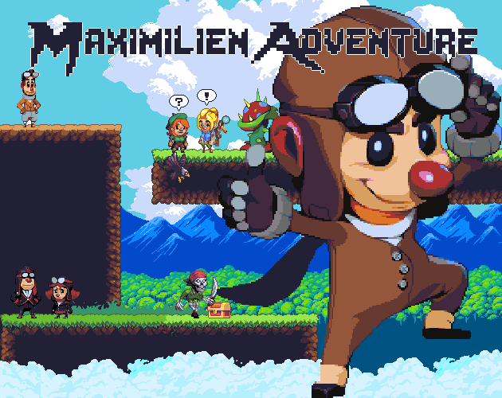
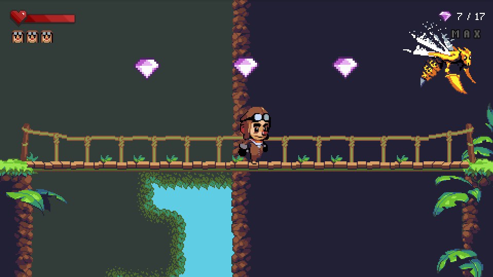
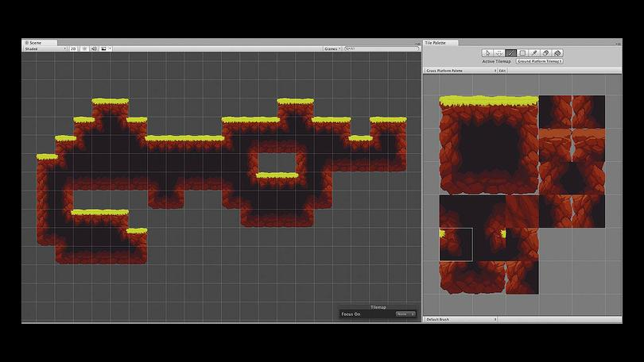
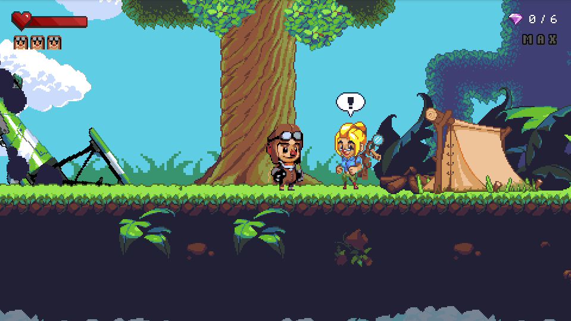
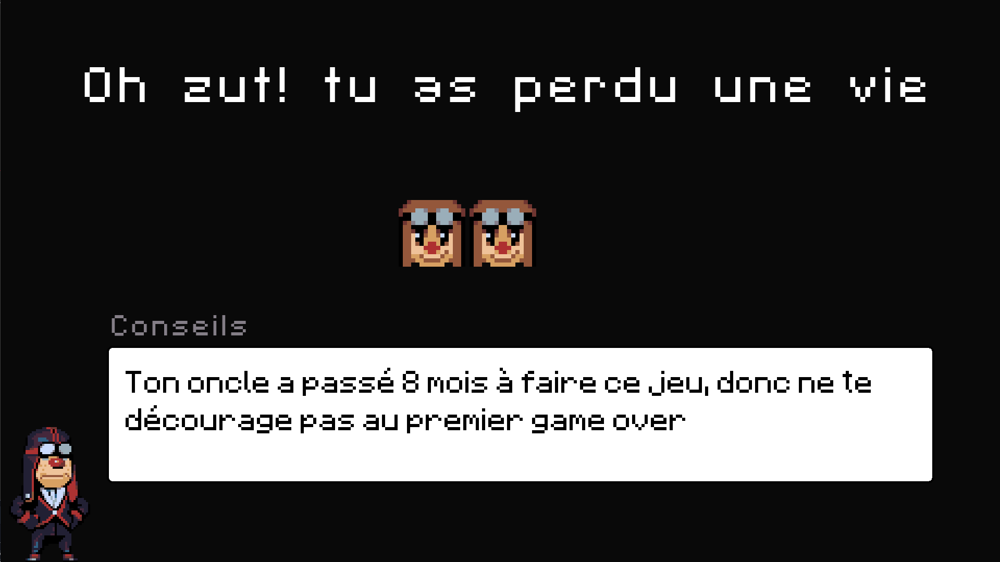

The first thing I thought, when my older sister tells me about her pregnancy, was "*I'm gonna be an uncle...more than that, I'm gonna be a cool uncle, the one I never add*". A good mindset but pretty hard to achieve when you live overseas and you barely see your relatives. But it didn't stop me, I was able to see my nephew 3 times during is first 5 years on this earth. One at 6 months, one at 2 years old, and the last one at 4. Not a great start to be that cool uncle you can said. But no, my little nephew really likes me, whenever my mom said the word Nintendo, he directly through about me (I let him play with my switch when he was 2 and he seems to have been a great experience for him).

I was cool for him, but not as "cool" like I wish to be. That's why I got a great idea, his parents aren't the gamer type and I knew how Maximilien associates me with video games, so why not create his own first real game? 

That how the project "Maximilien adventure" started.

## State of the project

The project was published on [itch.io](https://levrault.itch.io/maximilien-adventure) on the 20 May for Max's fifth birthday. The little guy certainly has finished the 20 levels like an hundred times. Whenever I got him on the phone, he is so happy to tell me how he can beat a level and find all the gems and secrets without dying. It a complete success.

But I didn't only gain one fan, but a second one I never expected. My own mother. She's not a gamer, she's in her sixty, play a little bit on Facebook and the last real video games she has played was certainly Mario Kart in 1998 with me (she beats me that day). But she was so excited to play with her grandchild that she was my first beta tester, since like she said "I need to trains to show how good I can be to Maximilien". 

She did play a lot, she also found a lot of bugs and give me great feedback. She found the run and jump mechanic a little bit hard but found the game perfect for Maximilien. It made me happy. 

At the end, for my mom's birthday, I gave her her own Xbox controller so she could continue to train herself. 

## What went wrong

During the 8 months development cycle, everything didn't go as planned. I really enjoy the Godot Engine but it got some flaws that are hard to ignore. 

### Tilemap

The UI isn't good. I really think Unity has a more convenient tilemap system than Godot. Just check it out:

**Unity**

**Godot**

Unity provides a nice and easy to use, overview of the complete tilemap while Godot divide it into a confusing tile array. 

Just by switching to UI similar to unity, I would have gained so much time. It's way easier to find a specific tile that way.

### Dialogues and translation

Internationalization is pretty easy with Godot, you just need to set up a CSV all the keys and translations. Easy and fast. But, when you manage the CSV file through differents OS (Windows and Linux), it's better to edit it inside a text editor than an external CSV reader (excel, LibreOffice, etc.). Because, sometimes, the file is corrupted and you can't do anything to fix it. You can check how messy the file looks [right here](https://github.com/Levrault/godot-maximilien-adventure/blob/master/i18n.csv) and it's messier inside vs code. 

Is that a Godot issue? Not really, it just bad luck coupled with my strange dialogue system. I create a parser to add a new line every time a @ is found, it's only made my CSV file harder to manage.

## What went right

### Level design

The hardest challenge was to create a game easy enough for a 5 years old with no gaming experience but with just the right amount of challenge to make it rewarding. I know that Maximilien still has some trouble with the run and jump mechanic (if you run you make a longer jump) but the overall "fun" factor is present for the little guy. 

My main idea to give a challenge and some replay value to the each level was to let the player collect some gems and also three hidden letters (M-A-X). I knew that Maximilien would find everything in the first session and I through it would be rewarding for him to find multiples kinds of treasures. I was right, it has tickle is sense of exploration and he feels more rewarded when he collects both gems and treasures.

I also give the player 3 lives per level with a life bar. So Max wouldn't fear to explore since he knew he has multiples try before loosing a life. For the hardest level, I also added a checkpoint, to reduce the possible frustration.

But sometimes life can be hard and Max could achieve a game over by loosing a life, I created a funny game over screen with some jokes in it to keep it motivated.

> Your uncle has worked 8 months on that game, please don't give up at the first game over

### Boss fight

I really thought that I would have the time to do it but I did it. Nothing more to say about that. It's just a simple state machine that make the monster follow the player with a little "mise en scène".

### Art

Using the [open pixel project](https://www.openpixelproject.com/) was the best choice from the start. Save me a lot of time and provide some top-notch visuals.

## What's next

Maximilien has a little sister (3y) and she seems a bit jealous. She is a little bit too young to have her first game but the development of Margot-Béatrice adventure has started. 

But since I got 2 years, I really take my time. So much time that I decide to create some useful tools to improve my development workflows. 

- A starter pack, to quickly create a new project
- My own dialogue editor

